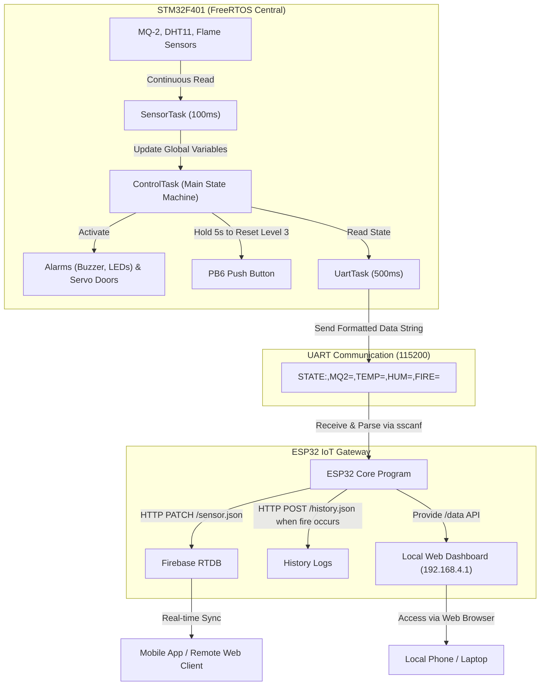

# SMART FIRE WARNING SENSOR SYSTEM (IoT)
> **An integrated project featuring STM32F401 Microcontroller, Real-Time Operating System (FreeRTOS), and ESP32 Gateway connected to Firebase & Web Dashboard.**

## Table of Contents
1. [1. Project Introduction](#1-project-introduction)
2. [2. Technologies Used](#2-technologies-used)
3. [3. Architecture Diagram and Operating Principle](#3-architecture-diagram-and-operating-principle)
4. [4. Pin Mapping](#4-pin-mapping)
5. [5. System Warning Levels](#5-system-warning-levels)
6. [6. Source Directory Structure](#6-source-directory-structure)
7. [7. Installation and Deployment Guide](#7-installation-and-deployment-guide)
8. [8. Web Dashboard Interface](#8-web-dashboard-interface)

---

## 1. Project Introduction

The **Smart Fire Warning System** is a comprehensive safety monitoring solution for homes and kitchens. The project utilizes a dual-microcontroller (Dual-MCU) system communicating via the UART protocol:
*   **STM32F401 (Running FreeRTOS)** acts as the "Central Control Brain" (Core Controller). It performs real-time sensor data acquisition, manages the warning State Machine, activates the buzzer and LED indicators, and controls RC Servo motors to automatically open emergency exits/windows in the event of an incident.
*   **ESP32 NodeMCU** acts as the "IoT Connection Gateway" (Communication Gateway). It receives analytical data from the STM32, hosts a configuration WiFi network (Captive Web Portal), displays an internal monitoring page (Local Dashboard), and continuously synchronizes data to the Firebase Realtime Database cloud for remote tracking.

---

## 2. Technologies Used

*   **STM32 Firmware**:
    *   **Language**: C
    *   **Real-time OS**: FreeRTOS (CMSIS_OS2 API) for multi-tasking management.
    *   **Tools**: STM32CubeMX & STM32CubeIDE.
*   **ESP32 Firmware (Gateway)**:
    *   **Language**: C++ (Arduino Framework).
    *   **Web Features**: `WebServer`, `WiFi` (AP & STA Modes) for flexible network configuration.
    *   **Cloud**: Firebase REST API (utilizing lightweight PATCH/POST requests without heavy libraries).
*   **Dashboard Interface**: HTML5, CSS3 (Modern, responsive Dark Mode design), Vanilla JavaScript.

---

## 3. Architecture Diagram and Operating Principle

The system operates based on a distributed processing model:



---

## 4. Pin Mapping

### 1. STM32F401CCU6 Microcontroller (Blackpill)

| Peripheral / Device | STM32 Pin | Configuration Mode | Detailed Description |
| :--- | :---: | :---: | :--- |
| **MQ-2 Gas/Smoke Sensor** | `PA3` | ADC1_IN3 | Read analog value of gas/smoke concentration |
| **DHT11 Temp/Humidity Sensor** | `PA5` | GPIO Input/Output | Read digital data via 1-wire protocol |
| **Flame Sensor** | `PA7` | GPIO Input (Pull-up) | `LOW` level when infrared flame is detected |
| **Servo Motor 1** | `PB0` | TIM3_CH3 (PWM) | Triggers open/close of **Window** |
| **Servo Motor 2** | `PA1` | TIM2_CH2 (PWM) | Triggers open/close of **Kitchen Door** |
| **Servo Motor 3** | `PA2` | TIM2_CH3 (PWM) | Triggers open/close of **Emergency Exit Door** |
| **Buzzer** | `PB5` | GPIO Output | Audio chip alarm |
| **Red LED (Warning)** | `PB4` | GPIO Output | Flashing LED for dangerous situations |
| **Green LED (Exit)** | `PB3` | GPIO Output | Emergency exit indicator LED, stays ON during fire |
| **Level 3 Reset Button** | `PB6` | GPIO Input (Pull-up) | Hold for 5 seconds to turn off the fire alarm |
| **UART1 TX (Transmit)** | `PA9` | USART1_TX | Connects to ESP32 RX pin |
| **UART1 RX (Receive)** | `PA10` | USART1_RX | Connects to ESP32 TX pin (optional) |

### 2. ESP32 Gateway Module

| ESP32 Pin | Connects to | Role / Responsibility |
| :---: | :---: | :--- |
| `Pin 26 (RX2)`| STM32 `PA9 (TX)` Pin | Receives state data stream from STM32 |
| `Pin 27 (TX2)`| STM32 `PA10 (RX)` Pin| Responds to STM32 events (when needed) |
| `GND` | STM32 `GND` Pin | Common ground for both microcontrollers |

---

## 5. System Warning Levels

The system automatically transitions states based on sensor readings:

| State | Activation Threshold | Buzzer | LED Indicators | Door States (Servos) | Special Behavior |
| :--- | :--- | :--- | :--- | :--- | :--- |
| **STATE_NORMAL** *(Level 0)* | Normal | Fully OFF | Red OFF, Green OFF | Close all doors | System is in safe monitoring mode. |
| **STATE_LEVEL1_WARNING_GAS** *(Level 1)* | Gas $\ge$ 1800 | OFF | Red blinks slowly (0.5s) | **Open Window** | Ventilate gas. Return to Level 0 after 5s of stable gas (< 700). |
| **STATE_LEVEL2_DANGER_TEMP** *(Level 2)* | Temp $\ge$ 40°C | Intermittent (0.3s) | Red blinks intermittently | **Open Window & Kitchen Door** | High-temperature danger warning. Auto-exit warning when temp drops (< 35°C). |
| **STATE_LEVEL3_FIRE** *(Level 3)* | Flame Detected | Continuous alarm | Green ON, Red blinks fast | **Open all 3 doors** | **Lock warning state**. Released only by holding PB6 button for 5 seconds. |

> [!IMPORTANT]
> **Level 3 Latch Mechanism**: When the flame sensor detects a fire, the system immediately locks into **Level 3**. Even if the fire is put out (the sensor no longer detects flames), the buzzer alarm will keep sounding and the emergency exits will remain open to ensure absolute safety. The supervisor must inspect the scene in person and hold down the button on the STM32 (pin `PB6`) for **5 seconds** to reset the system back to normal.

---

## 6. Source Directory Structure

```text
HeThongCanhBaoChay/
├── ESP/                         # Firmware for ESP32 (Arduino IDE)
│   ├── ESP.ino                  # Main Setup & Loop entry point
│   ├── data.h / data.cpp        # Shared sensor variables definition
│   ├── uart.h / uart.cpp        # Buffer management & parsing of UART packets from STM32
│   ├── web.h / web.cpp          # WiFi AP/STA, HTML portal & Local Dashboard management
│   └── firebase.h / firebase.cpp# Firebase communication via HTTP REST API & NTP synchronization
│
├── stm32-freeRTOS/              # Firmware for STM32F401 (STM32CubeIDE)
│   ├── Core/
│   │   ├── Src/
│   │   │   ├── main.c           # CubeMX default generated file, calls KhoiTao()
│   │   │   └── freertos.c       # Operating system task definitions
│   │   ├── Inc/
│   │   │   └── main.h           # GPIO hardware pin definitions
│   │   └── libraries/           # Driver libraries written for each peripheral
│   │       ├── chuongtrinhchinh/# State Machine & Main Logic (3 FreeRTOS Tasks)
│   │       ├── MQ-2/            # Read ADC channel from gas sensor
│   │       ├── Nhietdo/         # Read and decode DHT11 data
│   │       ├── FireSensor/      # Read flame sensor status
│   │       ├── Servo/           # Control Servo angle via PWM
│   │       ├── Buzzer/          # Control buzzer frequency
│   │       ├── led/             # Turn ON/OFF/Blink indicators LEDs
│   │       └── button/          # Check button press & hold conditions
│   └── Hethongcambienv2.ioc     # STM32CubeMX hardware pin configuration file
└── README.md                    # Project documentation (Current file)
```

---

## 7. Installation and Deployment Guide

### 1. Hardware Preparation
*   1x STM32F401CCU6 (Blackpill) Board & ST-Link V2 Programmer.
*   1x ESP32 NodeMCU Board.
*   3x RC Servo Motors (SG90 or MG90S).
*   1x DHT11 Temperature & Humidity Sensor.
*   1x MQ-2 Gas/Smoke Sensor.
*   1x Flame Sensor (Active Low).
*   1x 5V Buzzer, 2x LEDs (Red, Green), 1x Limit switch button.
*   Stable 5V-2A Power Supply (Since the system runs 3 Servo motors simultaneously).

### 2. STM32 Firmware Deployment
1.  Download and install [STM32CubeIDE](https://www.st.com/en/development-tools/stm32cubeide.html).
2.  Open the `stm32-freeRTOS` folder using STM32CubeIDE.
3.  Compile the project.
4.  Connect ST-Link V2 from your computer to the STM32 board and flash the program (`Run` / `Debug`).

### 3. ESP32 Firmware Deployment
1.  Open Arduino IDE (Make sure the ESP32 Core library package is installed).
2.  Open `ESP.ino` file located in the `ESP` folder.
3.  Update your Firebase Realtime Database address in the `firebase.cpp` file (if necessary):
    ```cpp
    #define DATABASE_URL "https://your-project-default-rtdb.firebaseio.com"
    ```
4.  Select `ESP32 Dev Module` board and the corresponding COM port.
5.  Click `Upload`.

---

## 8. Web Dashboard Interface

Upon power-up, the ESP32 will broadcast its own WiFi hotspot:
*   **SSID (WiFi Name)**: `Nhom1_To1`
*   **Password**: `12345678`

### Configuration & Monitoring Workflow:
1.  Connect your phone or computer to the `Nhom1_To1` WiFi network.
2.  Open any web browser and go to the default IP address: `192.168.4.1`.
3.  **WiFi Connection Page**: On first access, the ESP32 will list nearby WiFi networks. Enter your home WiFi password to connect the ESP32 to the Internet.
4.  **Dashboard Page**: Once successfully connected, the browser will automatically redirect to the Local Monitoring Dashboard. The intuitive interface displays:
    *   **System Status**: Color-coded warnings (Green: Safe | Yellow/Orange: Gas/Temperature warning | Flashing Red: **FIRE DETECTED**).
    *   **Sensor Parameters**: Real-time values of MQ-2, Temperature (°C), Humidity (%), and Flame sensor signal.
    *   **Network Information**: Currently connected WiFi name and allocated IP address.
